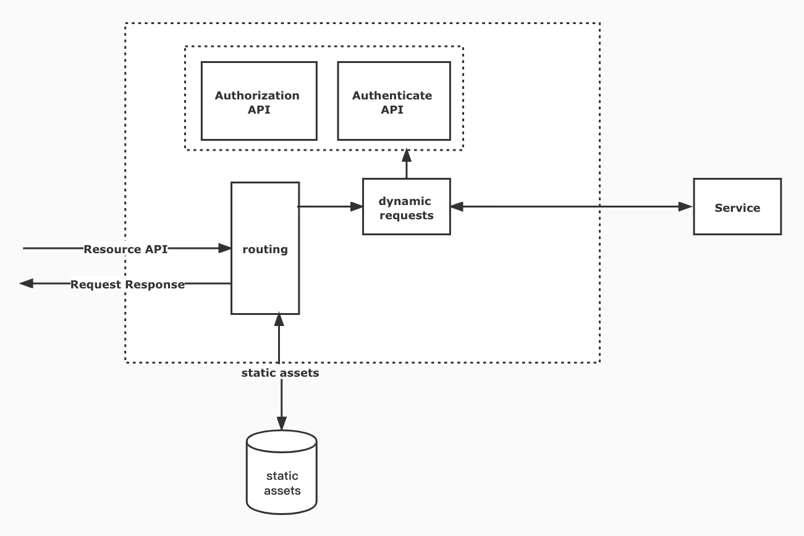

 # Goals
 HTTP server has a few key jobs to take care of
 * dynamic requests
 * static assets
 * Accept connections


# dynamic requests
`http.Request` contains all information about the request and it’s parameters

``` go
http.HandleFunc("/", func (w http.ResponseWriter, r *http.Request) {
    fmt.Fprint(w, "xxx!")
})
```

## parameters

the `http.Request` contains all information about the request and it’s parameters

* **GET parameters**: `r.URL.Query().Get("token")`  

* **POST parameters (fields from an HTML form)**: `r.FormValue("email")`.


# static assets
 To serve static assets like JS, CSS and images, we use the inbuilt http.FileServer and point it to a url path. For the file server to work properly it needs to know, where to serve files from. 
 ## use local
 ``` go
fs := http.FileServer(http.Dir("static/"))
    
 ```
if use file servser, we did like the dynamic requests.
## use file server
``` go
http.Handle("/static/", http.StripPrefix("/static/", fs))
```


# accept connections
 The HTTP Server must listen on a specific port (like 80 or 8080 )to be able to accept connections from the internet. **Go has also an inbuilt HTTP server**, we can start faily quickly.
 ``` go
 http.ListenAndServe(":80", nil)
 ```
# routing
Package `gorilla/mux`  implements a request router and dispatcher for matching incoming requests to their respective handler.
The biggest strength of the `gorilla/mux`  Router is the ability to extract segments from the request URL. As an example, this is a URL in your application:
`/prdoucts/sku111210`
`

``` go
r := mux.NewRouter()
r.HandleFunc("/products/{key}", ProductHandler)
r.HandleFunc("/articles/{category}/{id:[0-9]+}", ArticleHandler)
```

# TODO
## Architecture



## Core


* API
* authenticate & authorization
* waf
